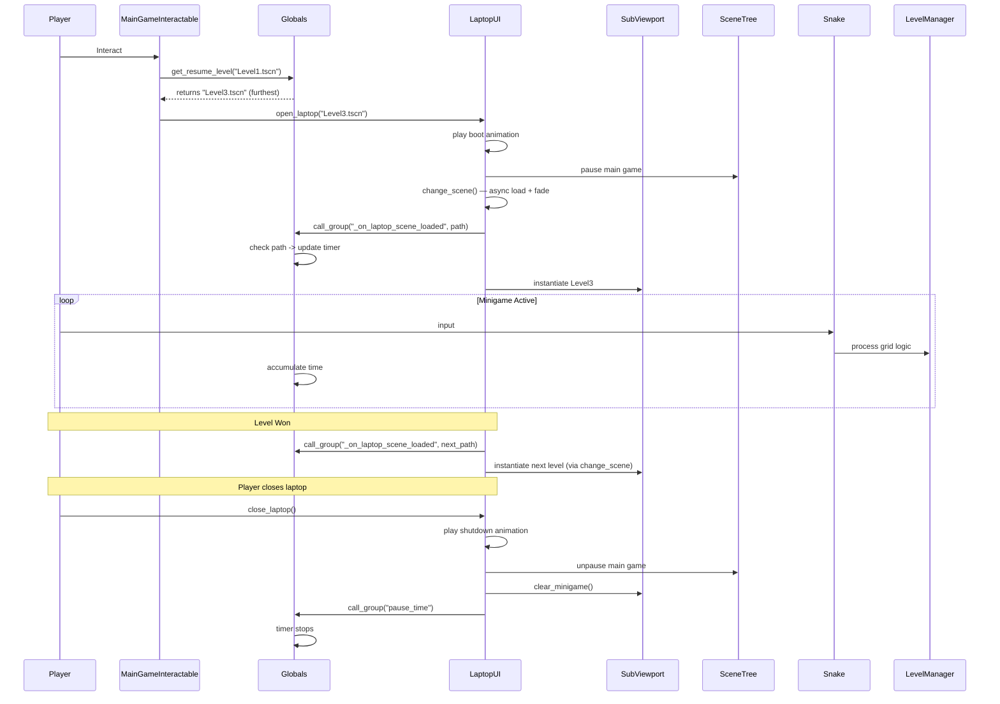

# Snake Tower Minigame Documentation

This document provides a comprehensive overview of the **Snake Tower** minigame architecture, detailing its core components, entity interactions, grid management system, and how it integrates seamlessly with the broader project through the `SceneManager` and `LaptopUI` systems. This serves as critical context for future development and AI assistance.

## 1. Architectural Overview

Snake Tower is a grid-based puzzle game operating within a discrete spatial environment. Instead of physics-based continuous movement, all logic revolves around integer-based coordinates (`Vector2i`). The architecture relies heavily on a centralized **LevelManager** pattern, where all entities report their grid positions to a single source of truth, enabling predictable collision, gravity, and interaction systems without needing Godot's built-in physics engine.

### Core Paradigms
*   **Grid Registration:** Every static and dynamic object registers itself to the `LevelManager` on `_ready()`.
*   **Decoupled Interaction:** The Snake (Player) and Boxes don't check collisions against Area2D/KinematicBody nodes. They query `LevelManager.get_cell(target_pos)` to determine what exists at a specific grid coordinate.
*   **Tick-based Gravity:** Gravity is handled on a timer (tick) rather than continuously, creating a snapping, grid-locked falling animation.

---

## 2. The Grid System (`LevelManager.gd`)

The `LevelManager` is an Autoload singleton (or a persistent node manager) responsible for the state of the grid. It acts as the spatial database for the level.

### Cell Types
The grid stores data using the `CellType` enum:
```gdscript
enum CellType {
	EMPTY, TERRAIN, APPLE, SPIKE, GOAL, SNAKE_BODY, SNAKE_HEAD, BOX
}
```

### Key Responsibilities
*   **Data Structures:** Uses Dictionaries (`grid`, `apple_nodes`, `spike_nodes`, `box_nodes`) mapping `Vector2i` positions to `CellType` enum values and their respective Node references.
*   **Registration (`register_cell` / `unregister_cell`):** Used by entities to claim or release grid coordinates.
*   **Spatial Queries:** 
	*   `get_cell(pos)`: Returns what entity type occupies the given coordinate.
	*   `is_solid(pos)`: Determines if a coordinate blocks movement.
	*   `check_support(segments)`: Determines if gravity should apply. A snake or box is "supported" if *any* of its segments rests on a harmless solid block (Terrain, Apple, or Box). Spikes do not provide support.
*   **Event Signals:** Emits high-level game state signals: `level_won`, `level_lost`, `apple_eaten`.

---

## 3. Entities

Entities are the building blocks of the Snake Tower levels. They generally follow a pattern of calculating their grid position from their pixel position `(position / TILE_SIZE).round()` and registering themselves deferred on `_ready()`.

| Entity | Script | Behavior |
| :--- | :--- | :--- |
| **Terrain** | `TerrainTileMap.gd` | Static environment. Iterates over `get_used_cells()` and registers each as `TERRAIN`. Blocks movement. Provides gravity support. |
| **Apple** | `Apple.gd` | Consumable item. When the Snake attempts to enter its cell, the snake grows, and `queue_free()` is called. Provides gravity support. |
| **Spike** | `Spike.gd` | Lethal obstacle. If the snake's head enters its cell, or if the snake falls onto it via gravity, it triggers `level_lost`. Does *not* provide gravity support. |
| **Goal** | `GoalFlag.gd` | Win condition. Triggers `level_won` upon intersection. |
| **SnakeTail** | `SnakeTail.gd` | Pre-placed snake body segments. They register as `SNAKE_BODY`. When the main `Snake.gd` initializes, it absorbs these nodes, destroys them, and takes over their grid positions. |
| **Box** | `Box.gd` | Pushable dynamic entity. Has its own gravity processing. Can be pushed horizontally if the target adjacent cell is `EMPTY`. Falls if the cell immediately below is `EMPTY`. |
| **DeathFloor** | `DeathFloor.gd` | An invisible out-of-bounds trigger. In `_ready()`, registers its Y coordinate to `LevelManager.death_y`. If any snake segment falls to or below this line, it triggers `level_lost`. It provides a grid-native way to implement falling off the map without relying on Godot physics or `WorldBoundaryShape2D`. |
| **CameraLimit** | `CameraLimit.gd` | A utility entity to set a hard bottom limit for the game camera. In `_ready()`, registers its Y coordinate to `LevelManager.camera_limit_y`. If present, the camera stops following the player down at this line, decoupling the visual viewport edge from the lethal `DeathFloor` boundary. |

---

## 4. Player Controller (`Snake.gd`)

The `Snake.gd` is the most complex entity, handling input, multi-segment movement, collision resolution, and dynamic gravity.

### Movement Logic
1.  **Input:** Reads directional inputs (`snake_up`, `snake_down`, `snake_left`, `snake_right`).
2.  **Validation (`try_move`):** Calculates the target grid position for the head. 
    *   If targeting `TERRAIN`, movement is blocked.
    *   If targeting `SNAKE_BODY`, movement is blocked (cannot intersect self).
    *   If targeting `BOX`, calls `box.try_push(dir)`. If the box moves, the snake follows.
3.  **Execution (`move_segments`):** Unregisters all current segments from the grid. Calculates the new array of positions (each segment inherits the position of the one ahead of it).
4.  **Growth:** If an `APPLE` was hit, a new visual segment is instantiated, and the tail's previous position is preserved as the new segment.
5.  **Re-registration:** Registers the new positions back to the `LevelManager`.

### Gravity Logic
*   **Check Phase:** Calls `LevelManager.check_support(segments)`. If unsupported, `is_falling = true`.
*   **Fall Phase:** Every `fall_interval` (0.07s), the entire snake shifts down by `Vector2i(0, 1)`.
*   **Lethality:** During a fall step, it explicitly checks `check_gravity_death` and `check_gravity_win` to resolve landing on spikes or the goal. It also checks if any segment's Y coordinate exceeds `LevelManager.death_y` (configured by a `DeathFloor` node) to trigger a reset if the snake falls off the map.

### Visuals & Audio
*   **Head Rotation:** The snake's head sprite dynamically rotates and flips to match the current movement direction based on a configuration dictionary. It utilizes centered positioning to rotate strictly around its grid cell center.
*   **SFX Placeholders:** `Snake.tscn` contains dedicated `AudioStreamPlayer` nodes (`MoveAudio`, `EatAudio`, `DieAudio`). These are triggered internally by `Snake.gd` during relevant grid interactions (e.g., eating an apple, falling on a spike, or moving successfully).

---

## 5. Global State & Timers (`Globals.gd`)

`Globals.gd` is an Autoload singleton dedicated to tracking persistence across level changes. It handles the **Total Time Elapsed**, tracks the **Furthest Unlocked Level**, prevents level regression, and provides a **Save-Scum Timer System**.

*   **Process Mode:** Set to `Node.PROCESS_MODE_ALWAYS` so it continues to calculate delta time even when the main game tree is paused.
*   **Save-Scum Timer System:** To prevent penalizing players for trying to figure out a puzzle, the timer uses a save-scum mechanic.
	*   `current_level_time`: A temporary variable tracking the time spent on the current attempt. This is incremented every frame during active gameplay.
	*   `total_time_elapsed`: A persistent datastore of accumulated time across all completed levels.
	*   When the player wins a level (touches the goal), `Globals.commit_time()` is called, moving the temporary time into the persistent datastore.
	*   When a level is reset, restarted due to death, or the player closes/opens the laptop, `Globals._on_scene_loaded` triggers and instantly resets the `current_level_time` to `0.0`. This discards any time spent on a failed attempt.
*   **Dynamic Real-Time UI (`Level.gd`):** The total elapsed time is dynamically displayed on screen (from Level 2 onwards). Rather than manually editing each `.tscn` file, `Level.gd` instantiates a `Label` on `_ready()`, aligns it beneath the physical reset button, and seamlessly sums `total_time_elapsed` and `current_level_time` every frame.
*   **Return to Home UI (`Level*.tscn` & `Level.gd`):** Each level scene contains a `HomeButton` node within its `UILayer`, positioned alongside the Reset button. Pressing this button triggers the `return_to_home()` method inside `Level.gd`, which uses `_switch_level(home_scene_path)` to safely navigate back to the designated starting level (configurable via the `@export var home_scene_path`). This transition fully integrates with the `LaptopUI` system.
*   **Scene Hook:** Connects to `SceneManager.scene_loaded`. When a scene finishes loading, it checks if the scene path is within a valid minigame directory (`res://scenes/snake_tower/level/`) or explicitly listed in a dictionary. If valid, the timer runs; if it is the final end screen (`LevelLast.tscn`) or invalid, it pauses.
*   **Level Tracking (`current_minigame_level`):** Maintains the path to the highest level the player has reached. Upon winning a level, it calculates the next level and updates this variable.
*   **Anti-Regression (`get_resume_level(path)`):** A helper function exposed to callers who want to launch the minigame. It intercepts requests for early levels and forcefully returns the furthest unlocked level instead, allowing players to safely "resume" their progress after closing the laptop.
*   **Group Listener:** It is part of the `"minigame_time_trackers"` group. It implements a `pause_time()` function to allow external modules to blindly pause it without hardcoded references.

---

## 6. Integration: LaptopUI

The minigame does not run directly in the main world space; it is a nested simulation within an in-game holographic laptop screen.

### `LaptopUI.gd`
A self-contained `CanvasLayer` representing the diegetic holographic interface. It owns its own asynchronous scene loading and fade transition system — it does **not** delegate to `SceneManager`.
*   **Opening:** Plays a holographic boot animation, pauses the main game (`get_tree().paused = true`), and loads the target minigame scene into its internal `SubViewport` via `LaptopUI.change_scene()`. Since `LaptopUI` has `PROCESS_MODE_ALWAYS`, it functions normally while the background world freezes.
*   **Level Transitions:** When a minigame needs to advance levels, `Level.gd` discovers the host laptop via `get_tree().get_nodes_in_group("laptop_ui")` and calls `laptop.change_scene(target_scene, 0.5)`. This triggers a localized fade-to-black within the laptop screen without affecting the main game view.
*   **Timer Synchronization:** Before instantiating a new scene, `LaptopUI` calls `get_tree().call_group("minigame_time_trackers", "_on_laptop_scene_loaded", path)` so that `Globals.gd` can update its timer state before the new level's `_ready()` fires.
*   *Note on Modularity:* `LaptopUI` does not track snake tower logic. Callers should wrap their requested paths with `Globals.get_resume_level(path)` before calling `open_laptop()` to ensure proper progression logic is respected.
*   **Closing:** Plays a holographic shutdown animation, hides the UI, unpauses the main game, clears the `SubViewport` contents to free memory, and broadcasts a `"pause_time"` method call to the `"minigame_time_trackers"` group. This ensures `Globals.gd` stops counting time when the player closes the laptop.

### Integration Flow Diagram



## 7. Future Minigame Considerations

Because `LaptopUI` is fully self-contained and utilizes Godot's Group system, adding a completely separate minigame inside the laptop interface requires minimal coupling:
1.  Create the new minigame scenes and its own global manager.
2.  Have the new manager `add_to_group("minigame_time_trackers")`.
3.  Implement a `pause_time()` and `_on_laptop_scene_loaded(path)` function inside the new manager.
4.  Implement any "resuming" or "anti-regression" rules directly in that new manager.
5.  Load it into the laptop by querying the new manager for the correct path and passing it to `LaptopUI.open_laptop(path)`.

`LaptopUI` will handle the rendering, transitions, and ensure the time tracking is perfectly synchronized with the open/close states of the holographic display.

---

## 8. Audio Integration

The Snake Tower utilizes the global `MusicManager` autoload for background music persistence and dedicated `AudioStreamPlayer` nodes for local sound effects.

*   **Background Music:** Upon loading any level (`Level.gd _ready()`), the minigame requests the `"minigame_bgm"` track from `MusicManager`. Because `MusicManager` handles track caching, this won't restart the song unnecessarily on every level reload.
*   **Home Transition:** When the player uses the Home button to exit the minigame, `Level.gd` instructs `MusicManager` to play the `"pet_home"` track, ensuring a seamless audio transition back to the main laptop desktop environment.
*   **Local SFX:** Movement, eating, and death sounds are handled locally within `Snake.tscn` using dedicated `AudioStreamPlayer` nodes triggered by `Snake.gd` and `Level.gd`.
