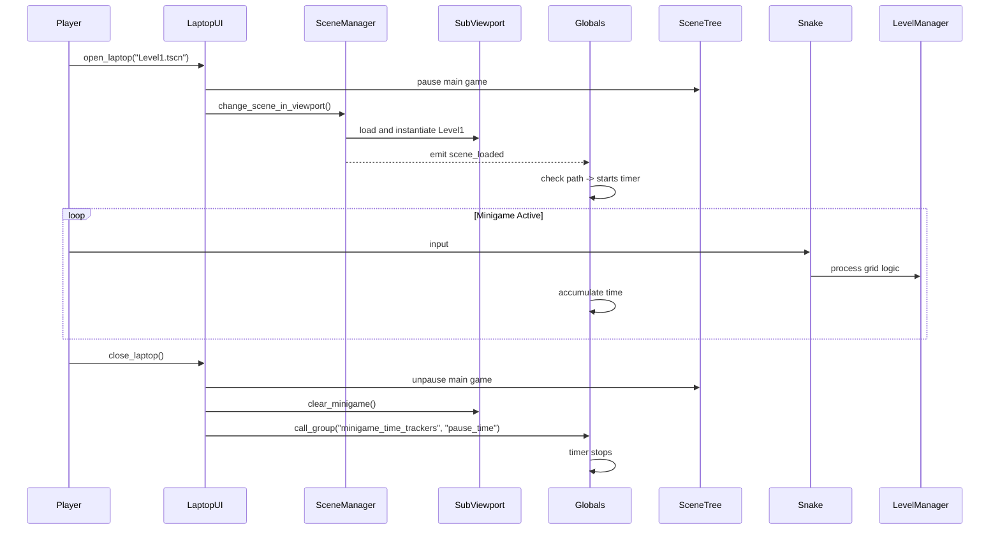

# Snake Tower Minigame Documentation

This document provides a comprehensive overview of the **Snake Tower** minigame architecture, detailing its core components, entity interactions, grid management system, and how it integrates seamlessly with the broader project through the `SceneManager` and `LaptopUI` systems. This serves as critical context for future development and AI assistance.

## 1. Architectural Overview

Snake Tower is a grid-based puzzle game operating within a discrete spatial environment. Instead of physics-based continuous movement, all logic revolves around integer-based coordinates (`Vector2i`). The architecture relies heavily on a centralized **LevelManager** pattern, where all entities report their grid positions to a single source of truth, enabling predictable collision, gravity, and interaction systems without needing Godot's built-in physics engine.

### Core Paradigms
*   **Grid Registration:** Every static and dynamic object registers itself to the `LevelManager` on `_ready()`.
*   **Decoupled Interaction:** The Snake (Player) and Boxes don't check collisions against Area2D/KinematicBody nodes. They query `LevelManager.get_cell(target_pos)` to determine what exists at a specific grid coordinate.
*   **Tick-based Gravity:** Gravity is handled on a timer (tick) rather than continuously, creating a snapping, grid-locked falling animation.

---

## 2. The Grid System (`LevelManager.gd`)

The `LevelManager` is an Autoload singleton (or a persistent node manager) responsible for the state of the grid. It acts as the spatial database for the level.

### Cell Types
The grid stores data using the `CellType` enum:
```gdscript
enum CellType {
	EMPTY, TERRAIN, APPLE, SPIKE, GOAL, SNAKE_BODY, SNAKE_HEAD, BOX
}
```

### Key Responsibilities
*   **Data Structures:** Uses Dictionaries (`grid`, `apple_nodes`, `spike_nodes`, `box_nodes`) mapping `Vector2i` positions to `CellType` enum values and their respective Node references.
*   **Registration (`register_cell` / `unregister_cell`):** Used by entities to claim or release grid coordinates.
*   **Spatial Queries:** 
    *   `get_cell(pos)`: Returns what entity type occupies the given coordinate.
    *   `is_solid(pos)`: Determines if a coordinate blocks movement.
    *   `check_support(segments)`: Determines if gravity should apply. A snake or box is "supported" if *any* of its segments rests on a harmless solid block (Terrain, Apple, or Box). Spikes do not provide support.
*   **Event Signals:** Emits high-level game state signals: `level_won`, `level_lost`, `apple_eaten`.

---

## 3. Entities

Entities are the building blocks of the Snake Tower levels. They generally follow a pattern of calculating their grid position from their pixel position `(position / TILE_SIZE).round()` and registering themselves deferred on `_ready()`.

| Entity | Script | Behavior |
| :--- | :--- | :--- |
| **Terrain** | `TerrainTileMap.gd` | Static environment. Iterates over `get_used_cells()` and registers each as `TERRAIN`. Blocks movement. Provides gravity support. |
| **Apple** | `Apple.gd` | Consumable item. When the Snake attempts to enter its cell, the snake grows, and `queue_free()` is called. Provides gravity support. |
| **Spike** | `Spike.gd` | Lethal obstacle. If the snake's head enters its cell, or if the snake falls onto it via gravity, it triggers `level_lost`. Does *not* provide gravity support. |
| **Goal** | `GoalFlag.gd` | Win condition. Triggers `level_won` upon intersection. |
| **SnakeTail** | `SnakeTail.gd` | Pre-placed snake body segments. They register as `SNAKE_BODY`. When the main `Snake.gd` initializes, it absorbs these nodes, destroys them, and takes over their grid positions. |
| **Box** | `Box.gd` | Pushable dynamic entity. Has its own gravity processing. Can be pushed horizontally if the target adjacent cell is `EMPTY`. Falls if the cell immediately below is `EMPTY`. |
| **DeathFloor** | `DeathFloor.gd` | An invisible out-of-bounds trigger. In `_ready()`, registers its Y coordinate to `LevelManager.death_y`. If any snake segment falls to or below this line, it triggers `level_lost`. It provides a grid-native way to implement falling off the map without relying on Godot physics or `WorldBoundaryShape2D`. |

---

## 4. Player Controller (`Snake.gd`)

The `Snake.gd` is the most complex entity, handling input, multi-segment movement, collision resolution, and dynamic gravity.

### Movement Logic
1.  **Input:** Reads directional inputs (`snake_up`, `snake_down`, `snake_left`, `snake_right`).
2.  **Validation (`try_move`):** Calculates the target grid position for the head. 
    *   If targeting `TERRAIN`, movement is blocked.
    *   If targeting `SNAKE_BODY`, movement is blocked (cannot intersect self).
    *   If targeting `BOX`, calls `box.try_push(dir)`. If the box moves, the snake follows.
3.  **Execution (`move_segments`):** Unregisters all current segments from the grid. Calculates the new array of positions (each segment inherits the position of the one ahead of it).
4.  **Growth:** If an `APPLE` was hit, a new visual segment is instantiated, and the tail's previous position is preserved as the new segment.
5.  **Re-registration:** Registers the new positions back to the `LevelManager`.

### Gravity Logic
*   **Check Phase:** Calls `LevelManager.check_support(segments)`. If unsupported, `is_falling = true`.
*   **Fall Phase:** Every `fall_interval` (0.07s), the entire snake shifts down by `Vector2i(0, 1)`.
*   **Lethality:** During a fall step, it explicitly checks `check_gravity_death` and `check_gravity_win` to resolve landing on spikes or the goal. It also checks if any segment's Y coordinate exceeds `LevelManager.death_y` (configured by a `DeathFloor` node) to trigger a reset if the snake falls off the map.

---

## 5. Global State & Timers (`Globals.gd`)

`Globals.gd` is an Autoload singleton dedicated to tracking persistence across level changes, primarily handling the **Total Time Elapsed**.

*   **Process Mode:** Set to `Node.PROCESS_MODE_ALWAYS` so it continues to calculate delta time even when the main game tree is paused.
*   **Scene Hook:** Connects to `SceneManager.scene_loaded`. When a scene finishes loading, it checks if the scene path is within a valid minigame directory (`res://scenes/snake_tower/level/`) or explicitly listed in a dictionary. If valid, the timer runs; if not, it pauses.
*   **Group Listener:** It is part of the `"minigame_time_trackers"` group. It implements a `pause_time()` function to allow external modules to blindly pause it without hardcoded references.

---

## 6. Integration: SceneManager & LaptopUI

The minigame does not run directly in the main world space; it is a nested simulation within an in-game laptop screen.

### `SceneManager.gd`
An Autoload responsible for seamless fade transitions and asynchronous loading.
*   It exposes `change_scene_in_viewport(path, viewport)`.
*   Instead of replacing the main `SceneTree`, it clears a specific target `SubViewport` and instantiates the new packed scene into it.
*   Emits `scene_loaded`, allowing systems like `Globals.gd` to react to new environments.

### `LaptopUI.gd`
A `CanvasLayer` representing the diegetic computer interface.
*   **Opening:** Pauses the main game (`get_tree().paused = true`), makes itself visible, and requests the `SceneManager` to load the target minigame scene into its internal `SubViewport`. Since `LaptopUI` has `PROCESS_MODE_ALWAYS`, it functions normally while the background world freezes.
*   **Closing:** Hides the UI, unpauses the main game, clears the `SubViewport` contents to free memory, and broadcasts a `"pause_time"` method call to the `"minigame_time_trackers"` group. This ensures `Globals.gd` stops counting time when the player minimizes the game.

### Integration Flow Diagram



## 7. Future Minigame Considerations

Because `LaptopUI` utilizes Godot's Group system, adding a completely separate minigame inside the laptop interface requires minimal coupling:
1.  Create the new minigame scenes and global managers.
2.  Have the new manager `add_to_group("minigame_time_trackers")`.
3.  Implement a `pause_time()` function inside the new manager.
4.  Load it into the laptop using `LaptopUI.open_laptop("res://path/to/new_minigame.tscn")`.

The `SceneManager` will handle the rendering, and `LaptopUI` will ensure the time tracking is perfectly synchronized with the open/close states of the laptop lid.
